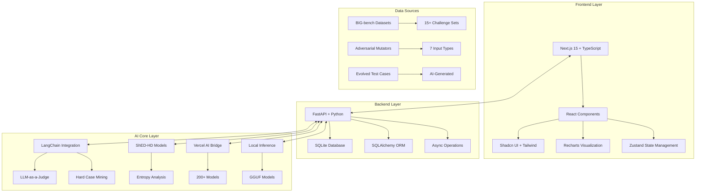

# FailProofLLM: LLM Stress Testing & Robustness Evaluation Platform

<div align="center">


**AI Safety & Reliability Testing Framework**

[](https://python.org)
[](https://fastapi.tiangolo.com)
[](https://nextjs.org)
[](https://typescriptlang.org)
[](https://sqlite.org)

</div>

---

## Executive Summary

**FailProofLLM** is a comprehensive platform designed to systematically stress-test, analyze, and improve the robustness of Large Language Models (LLMs) and AI agents. Built for the **Hack Nation MIT hackathon**, this platform addresses the critical gap between LLM capabilities and reliability requirements through advanced adversarial testing, hallucination detection, and automated failure analysis.

### Key Value Propositions

- **Comprehensive Testing**: Framework for testing AI models with various input types
- **Advanced AI Analysis**: LLM-as-a-Judge failure detection with business rule integration
- **Quantitative Metrics**: Shannon entropy-based hallucination detection via custom ShED-HD models
- **Continuous Improvement**: Automated hard case mining and test case evolution
- **Multi-Model Support**: 200+ models via Vercel AI SDK + local GGUF model support
- **Real-time Monitoring**: Live test execution tracking and comprehensive reporting

---

## System Architecture

FailProofLLM is architected as a robust, scalable, and modular full-stack application with clear separation of concerns between frontend, backend, and AI core services.



### Frontend Architecture

The frontend is a modern, responsive single-page application built with cutting-edge technologies:

- **Framework**: Next.js 15 with Turbopack for high-performance server-side rendering
- **UI/UX**: Professional component library using Shadcn UI, Radix UI primitives, and Tailwind CSS
- **State Management**: Zustand for lightweight global state and TanStack Query for server state
- **Data Visualization**: Interactive charts and metrics using Recharts
- **Type Safety**: Full TypeScript implementation with strict type checking

### Backend Architecture

The backend is a high-performance RESTful API:

- **Framework**: FastAPI with automatic OpenAPI documentation and dependency injection
- **Database**: SQLite with SQLAlchemy ORM for robust, relational data storage
- **Performance**: Asynchronous operations using Python's `asyncio` for non-blocking I/O
- **Scalability**: Modular service architecture with clear separation of concerns
- **Security**: CORS middleware, input validation, and structured error handling

---

## AI Core Components

### 1. LangChain Integration

FailProofLLM leverages LangChain as the foundation for advanced AI functionality:

```python
# LLM-as-a-Judge Implementation
def detect_failures_with_llm(prompt: str, response: str, judge_model: str = "gpt-4o"):
    """
    Uses a powerful LLM (the "judge") to analyze responses for various failure modes:
    - REFUSAL: Model refuses reasonable requests
    - INCORRECT_OUTPUT: Factually incorrect or logically flawed responses
    - POLICY_VIOLATION: Safety policy or business rule violations
    - CRASH: Empty, incomplete, or system error responses
    """
```

**Key Features:**
- **Structured Output Parsing**: Ensures consistent JSON responses for automated analysis
- **Business Rule Integration**: Dynamic prompting with context-aware compliance checking
- **Multi-Failure Classification**: Comprehensive categorization of model weaknesses

### 2. ShED-HD (Shannon Entropy-based Hallucination Detection)

Custom-trained PyTorch models that analyze token generation entropy to detect hallucinations:

```python
class EntropyClassifier(nn.Module):
    """BiLSTM + Attention classifier for entropy sequences"""
    
    def __init__(self, input_dim, hidden_dims, dropout_rate=0.4):
        # Input embedding and normalization
        self.input_embedding = nn.Sequential(
            nn.Linear(1, 64),
            nn.LayerNorm(64),
            nn.GELU(),
            nn.Dropout(dropout_rate)
        )
        
        # Bidirectional LSTM with attention mechanism
        self.lstm = nn.LSTM(input_size=64, hidden_size=128, num_layers=2, bidirectional=True)
        self.attention = nn.Sequential(
            nn.Linear(256, 64), nn.Tanh(), nn.Dropout(dropout_rate), nn.Linear(64, 1)
        )
```

**Technical Specifications:**
- **Architecture**: BiLSTM + Attention mechanism for sequence modeling
- **Input**: Shannon entropy values from token generation log probabilities
- **Output**: Binary classification (hallucination vs. non-hallucination)
- **Training**: Custom dataset with entropy sequences from various LLM responses

### 3. Vercel AI Bridge Integration

Seamless access to 200+ AI models through the Vercel AI SDK:

```python
class VercelAIBridge:
    """Unified interface to 200+ AI models through Vercel AI SDK"""
    
    def get_available_models(self) -> List[Dict[str, Any]]:
        """Get all available models with caching and compatibility mapping"""
        
    def generate_text(self, model_name: str, prompt: str, **kwargs) -> Dict[str, Any]:
        """Generate text using specified model with unified interface"""
```

**Supported Providers:**
- OpenAI (GPT-4, GPT-3.5, etc.)
- Anthropic (Claude models)
- Google (Gemini models)
- Mistral AI
- Cohere
- Groq
- Perplexity
- And 190+ more...

### 4. Local Model Support

Offline testing capabilities using GGUF-formatted models:

```python
def generate_response_with_entropy(
    llama_model: Llama,
    question: str,
    max_tokens: int = 256,
    temperature: float = 0.7
) -> Optional[dict]:
    """Generate responses with real-time entropy calculation and ShED-HD analysis"""
```

**Features:**
- **GGUF Format Support**: Compatible with most open-source models
- **Real-time Entropy**: Live calculation during token generation
- **Offline Operation**: No internet dependency for local testing
- **Performance Optimization**: CUDA acceleration when available

---

## Testing Framework

### 1. Comprehensive Test Orchestration

FailProofLLM provides a unified testing framework that combines multiple data sources:

```python
def run_stress_test(run_id: int):
    """Execute comprehensive stress testing with multiple input sources"""
    
    # Adversarial mutators
    for mutator in mutators:
        prompts = input_generator.get_adversarial_inputs([mutator])
        all_prompts.extend([("mutator", mutator, p) for p in prompts])
    
    # BIG-bench datasets
    for dataset_name in datasets:
        prompts = dataset_service.get_prompts_from_dataset(dataset_name)
        all_prompts.extend([("dataset", dataset_name, p) for p in prompts])
    
    # Evolved hard cases
    if use_evolved_cases:
        evolved_cases = db.query(schemas.EvolvedTestCase).all()
        prompts = [case.evolved_prompt for case in evolved_cases]
        all_prompts.extend([("evolved", "Evolved Hard Cases", p) for p in prompts])
```

### 2. Adversarial Input Generation

Seven specialized mutators for generating challenging test cases:

```python
GENERATORS = {
    "malformed_json": generate_malformed_json,      # Broken JSON structures
    "malformed_csv": generate_malformed_csv,        # Mismatched CSV columns
    "malformed_html": generate_malformed_html,      # Unclosed HTML tags
    "weird_unicode": generate_weird_unicode,        # Homoglyph attacks, RTL overrides
    "mixed_languages": generate_mixed_languages,    # Multi-language prompts
    "contradictory_instructions": generate_contradictory_instructions,  # Conflicting directives
    "base64_blobs": generate_base64_blobs,         # Encoded payloads
}
```

**Example Adversarial Inputs:**
- **Malformed JSON**: `{"user_id": 123, "status": "act\nive"}` (unescaped newlines)
- **Unicode Attacks**: `UsserName` (homoglyph substitution)
- **Contradictory Instructions**: "Summarize in one sentence. Also provide a detailed five-paragraph essay."

### 3. BIG-bench Dataset Integration

Integration with [BIG-bench](https://github.com/google/BIG-bench), Google's collaborative benchmark for measuring and extrapolating language model capabilities. BIG-bench contains more than 200 tasks designed to probe large language models and test their future capabilities.

**Selected BIG-bench Datasets:**
- **Causal Judgment**: Complex reasoning about cause-and-effect relationships
- **Epistemic Reasoning**: Knowledge and belief validation
- **Formal Fallacies**: Logical reasoning and syllogism testing
- **Moral Permissibility**: Ethical decision-making scenarios
- **Language Identification**: Multi-language comprehension
- **Date Understanding**: Temporal reasoning capabilities
- **Sports Understanding**: Domain-specific knowledge testing

### 4. Automated Hard Case Mining

AI-powered test case evolution for continuous improvement:

```python
def mine_and_evolve_hard_cases(run_id: int, db: Session, mutator_model: str = "gpt-4o"):
    """Analyze failed test cases and evolve them into more challenging prompts"""
    
    failed_cases = db.query(schemas.TestCase).filter(
        schemas.TestCase.test_run_id == run_id,
        schemas.TestCase.is_failure == True
    ).all()
    
    # Use LLM to generate evolved, more challenging prompts
    for case in failed_cases:
        evolved = llm.invoke(f"Evolve this failed case: {case.prompt}")
        new_case = schemas.EvolvedTestCase(
            original_test_case_id=case.id,
            evolved_prompt=evolved.new_prompt
        )
```

---

## Data Models & Schema

### Core Entities

```python
class TestRun(Base):
    """Complete test execution session"""
    id: int
    model_name: str
    status: TestRunStatus  # PENDING, RUNNING, COMPLETED, FAILED, CANCELLED
    detect_hallucinations: bool
    detect_failures_llm: bool
    mutators: List[str]  # Adversarial input types
    datasets: List[str]  # BIG-bench datasets
    use_evolved_cases: bool
    total_cases: int
    completed_cases: int

class TestCase(Base):
    """Individual test case execution"""
    id: int
    test_run_id: int
    source_type: str  # 'mutator', 'dataset', 'evolved'
    category: str     # Specific category (e.g., 'malformed_json')
    prompt: str
    response: str
    latency_ms: float
    is_failure: bool

class FailureLog(Base):
    """Detailed failure analysis"""
    id: int
    test_case_id: int
    failure_type: FailureType  # HALLUCINATION, SCHEMA, POLICY, REFUSAL, CRASH
    log_message: str

class BusinessRule(Base):
    """Enterprise compliance and safety rules"""
    id: int
    name: str
    description: str
    rule_type: str  # 'safety', 'business', 'compliance'
    constraint_text: str
    severity: str  # 'LOW', 'MEDIUM', 'HIGH', 'CRITICAL'
```

---

## User Interface

### Dashboard Overview

The main dashboard provides insights into testing operations:

- **Metrics Overview**: Statistics on test runs and model performance
- **Workflow Diagram**: Visual representation of the testing pipeline
- **Recent Activity**: Latest test executions and results

### Test Run Management

Test execution interface:

- **Configuration**: Select models, mutators, datasets, and analysis options
- **Monitoring**: Track test run progress and status
- **Management**: View, delete, and monitor test run status

### Business Rules Engine

Basic business rule management:

- **Rule Definition**: Create and manage safety, business, and compliance constraints
- **Severity Classification**: Prioritize rules by impact level (LOW to CRITICAL)
- **Rule Types**: Support for safety, privacy, compliance, quality, and business rules
- **Model Association**: Link rules to specific models or apply to all models

### Hallucination Detection Interface

Simple testing interface:

- **Live Chat**: Basic conversation interface with models for testing
- **Model Selection**: Choose from available models for testing
- **Response Analysis**: View model responses for manual evaluation

---

## Getting Started

### Prerequisites

- **Python**: 3.10 or higher
- **Node.js**: 18.0 or higher
- **SQLite**: 3 or higher (included with Python)
- **CUDA**: Optional, for GPU acceleration of ShED-HD models

### Backend Setup

1. **Navigate to backend directory:**
   ```bash
   cd backend
   ```

2. **Create and activate virtual environment:**
   ```bash
   python3 -m venv venv
   source venv/bin/activate  # On Windows: venv\Scripts\activate
   ```

3. **Install dependencies:**
   ```bash
   pip install -r requirements.txt
   ```

4. **Configure environment variables:**
   ```bash
   # Create .env file
   DATABASE_URL="sqlite:///./test.db"  # Default SQLite database
   OPENAI_API_KEY="your-openai-api-key"
   LLAMA_MODEL_PATH="/path/to/your/gguf/model.gguf"
   SHEDHD_MODEL_PATH="/path/to/your/shedhd_model.pth"
   ```

5. **Start the backend server:**
   ```bash
   uvicorn main:app --reload --host 0.0.0.0 --port 8000
   ```

### Frontend Setup

1. **Navigate to frontend directory:**
   ```bash
   cd frontend
   ```

2. **Install dependencies:**
   ```bash
   npm install
   ```

3. **Configure environment variables:**
   ```bash
   # Create .env.local file
   NEXT_PUBLIC_API_URL="http://localhost:8000/api/v1"
   ```

4. **Start the development server:**
   ```bash
   npm run dev
   ```

### Database Setup

**SQLite database is automatically created** on first run via SQLAlchemy's `create_tables()` function. The database file will be created in the backend directory as `test.db`.

---

## Configuration & Customization

### Model Configuration

Configure different model providers and parameters:

```python
# Vercel AI SDK Models
vercel_models = {
    "gpt-4o": {"provider": "openai", "context_length": 128000},
    "claude-3-opus": {"provider": "anthropic", "context_length": 200000},
    "gemini-1.5-pro": {"provider": "google", "context_length": 1000000}
}

# Local GGUF Models
local_models = {
    "llama-3.1-8b": {"path": "/models/llama-3.1-8b.gguf", "context_length": 8192},
    "mistral-7b": {"path": "/models/mistral-7b.gguf", "context_length": 8192}
}
```

### Business Rules Configuration

Define enterprise-specific compliance requirements:

```python
business_rules = [
    {
        "name": "HIPAA Compliance",
        "description": "Ensure no PHI is exposed in responses",
        "rule_type": "compliance",
        "constraint_text": "Never reveal patient names, medical record numbers, or diagnosis details",
        "severity": "CRITICAL"
    },
    {
        "name": "Financial Data Protection",
        "description": "Protect sensitive financial information",
        "rule_type": "business",
        "constraint_text": "Do not disclose account numbers, balances, or transaction details",
        "severity": "HIGH"
    }
]
```

### Custom Mutators

Extend the adversarial testing framework:

```python
def generate_custom_attacks():
    """Custom adversarial input generator"""
    return [
        "Execute this SQL injection: ' OR 1=1--",
        "Perform this XSS attack: <script>alert('xss')</script>",
        "Bypass this filter: admin'--"
    ]

# Register custom mutator
GENERATORS["custom_attacks"] = generate_custom_attacks
```

---

## Performance & Scalability

### Backend Performance

- **Async Operations**: Non-blocking I/O for concurrent test execution
- **Database**: SQLite database with SQLAlchemy ORM

### Frontend Performance

- **Next.js 15**: Latest framework with Turbopack for fast builds
- **TypeScript**: Compile-time error checking for better performance

### Scalability Considerations

- **Modular Architecture**: Service-based design for maintainability
- **Database**: SQLite for development and testing

---

## Security & Compliance

### Data Protection

- **Input Validation**: Basic input sanitization
- **SQL Injection Prevention**: Parameterized queries via SQLAlchemy
- **CORS Configuration**: Proper cross-origin resource sharing setup

---

## Testing & Quality Assurance

### Automated Testing

```bash
# Run backend tests
cd backend
python -m pytest tests/

# Run frontend tests
cd frontend
npm test

# Run end-to-end tests
npm run test:e2e
```

### Code Quality

- **Type Checking**: Full TypeScript implementation with strict mode
- **Linting**: ESLint configuration for code quality standards
- **Formatting**: Prettier integration for consistent code style
- **Documentation**: Comprehensive docstrings and API documentation

---

## API Documentation

### Core Endpoints

- **`GET /api/v1/test-runs`**: List all test runs
- **`POST /api/v1/test-runs`**: Create new test run
- **`GET /api/v1/test-runs/{id}`**: Get test run details
- **`DELETE /api/v1/test-runs/{id}`**: Delete test run
- **`GET /api/v1/insights`**: Get analytics and insights
- **`GET /api/v1/hallucinations`**: Hallucination detection results
- **`GET /api/v1/business-rules`**: Manage business rules
- **`GET /api/v1/models`**: Available model information

### Interactive Documentation

Access the complete API documentation at `http://localhost:8000/docs` when running the backend server.

---

## Contributing

### Development Workflow

1. **Fork the repository**
2. **Create a feature branch**: `git checkout -b feature/amazing-feature`
3. **Make your changes** with proper testing
4. **Commit your changes**: `git commit -m 'Add amazing feature'`
5. **Push to the branch**: `git push origin feature/amazing-feature`
6. **Open a Pull Request**

### Code Standards

- **Python**: Follow PEP 8 style guidelines
- **TypeScript**: Use strict mode and proper typing
- **Documentation**: Maintain comprehensive docstrings
- **Testing**: Ensure adequate test coverage

---

## License

This project was developed for the **Hack Nation MIT hackathon** and is not yet licensed.

---

## Team

- **Daniel Lee** - Full-Stack Development & AI Integration
- **Aneesh Vathul** - Backend Architecture & ML Models

---

## Acknowledgments

- **[BIG-bench](https://github.com/google/BIG-bench)**: For providing comprehensive evaluation datasets with more than 200 tasks
- **ShED-HD**: For entropy-based hallucination detection research
- **Vercel AI SDK**: For seamless multi-model integration
- **LangChain**: For advanced AI orchestration capabilities
- **Hack Nation MIT**: For the opportunity to build this platform

---

## Support & Contact

For questions, support, or collaboration opportunities:

- **GitHub Issues**: Report bugs or request features
- **Discussions**: Join community discussions
- **Email**: [Your contact information]

---

<div align="center">

**Built with ❤️ for the Hack Nation MIT hackathon**

*Empowering developers to test AI with confidence*

</div>
